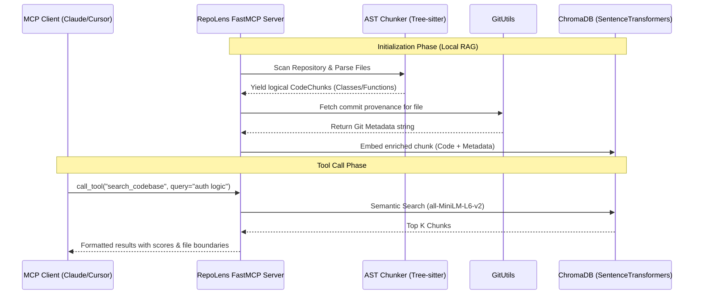

# RepoLens MCP: Context Layer for Local Codebases over Model Context Protocol

RepoLens MCP is a powerful Model Context Protocol (MCP) server that transforms any local Git repository into a highly queryable, context-rich knowledge base. It enables AI assistants (like Claude and Cursor) to navigate, search, and understand your entire codebase with semantic precision.

## Why RepoLens? (AST + Git > Naive RAG)

Traditional "Chat with your Code" or "Chat with PDF" systems use naive fixed-token splitting, breaking your codebase into arbitrary 500-token chunks. This destroys the context of large functions and classes. 

RepoLens takes a fundamentally better approach:
- **AST-Aware Chunking**: Uses `tree-sitter` to parse code into logical boundaries (Functions, Classes, Methods) rather than arbitrary text chunks.
- **Git Metadata Enrichment**: Merges Git commit history directly into the code chunk before embedding. The vector index understands not just *what* the code does, but *who* wrote it, *when*, and *why* (via commit messages).
- **Hybrid Context**: By combining ChromaDB dense vector similarity with deterministic Git history and absolute line-range extraction, the LLM receives perfectly bounded, highly relevant context.

## System Architecture



## Setup & Installation

### 1. Environment Setup

Ensure you have Python 3.11+ installed. Clone this repository and run the automated setup script.

**Windows (PowerShell):**
```powershell
.\setup.ps1
```

**macOS / Linux:**
```bash
./setup.sh
```

This will automatically create a virtual environment, install dependencies, run the test suite, and output the correct MCP configuration JSON for your system.

### 2. Client Integrations

RepoLens integrates seamlessly with standard MCP clients. Ensure you point the config to the generated virtual environment's Python executable.

#### Claude Desktop
Add the following to your `claude_desktop_config.json`:
- **Windows**: `%APPDATA%\Claude\claude_desktop_config.json`
- **macOS**: `~/Library/Application Support/Claude/claude_desktop_config.json`

```json
{
  "mcpServers": {
    "repolens": {
      "command": "/absolute/path/to/repolens-mcp/.venv/bin/python",
      "args": [
        "-m", "repolens-mcp"
      ],
      "env": {
        "REPO_PATH": "/absolute/path/to/target/repository",
        "CHROMA_PATH": "/absolute/path/to/repolens-mcp/chroma_db"
      }
    }
  }
}
```

*(Note: On Windows, the python path will end in `.venv\\Scripts\\python.exe` and `args` can point directly to `src\\server.py`)*

#### Cursor IDE
Add the following to `.cursor/mcp.json` in your target project:
```json
{
  "mcpServers": {
    "repolens": {
      "command": "/absolute/path/to/repolens-mcp/.venv/bin/python",
      "args": ["/absolute/path/to/repolens-mcp/src/server.py"],
      "env": {
        "REPO_PATH": "."
      }
    }
  }
}
```

### 3. Local Development & Inspector

To test the server locally with an interactive UI, use the FastMCP Inspector:

```bash
# Activate the virtual environment
source .venv/bin/activate  # or .venv\Scripts\activate on Windows

# Run the dev inspector
fastmcp dev inspector src/server.py
```

## Tool Reference

| Tool Name | Description | Parameters |
| :--- | :--- | :--- |
| `search_codebase` | Semantic vector search over the indexed repository. Finds code chunks most relevant to a natural language query. | `query` (str)<br>`top_k` (int, default: 5) |
| `read_file_content` | Safe line-range reader for any file in the repository. Prepends line numbers and prevents path-traversal. | `file_path` (str)<br>`start_line` (int, default: 1)<br>`end_line` (int, default: 200) |
| `get_file_history` | Retrieves the recent Git commit history (who, when, why) for a specific file. | `file_path` (str) |

## Benchmark Results (Phase 5)

RepoLens includes an automated evaluation framework to measure RAG retrieval performance against ground-truth developer queries.

Our baseline run on the RepoLens codebase itself (22 complex architectural & lookup queries) yields:

| Metric | Result | Description |
| :--- | :--- | :--- |
| **File Hit Rate** | **81.8%** | At least one correct file was retrieved in the top 5 results |
| **Recall@5 (files)** | 79.5% | Fraction of expected target files present in the top 5 |
| **Recall@5 (symbols)** | 47.0% | Fraction of exact expected functions/classes in the top 5 |
| **Search Latency** | ~18ms | Average latency per query for local ChromaDB lookup |
| **LLM Correctness** | 2.09 / 5.0 | Scored strictly using deterministic keyword-overlap fallback |

*(Run `python eval/run_eval.py --repo .` to regenerate these metrics)*
